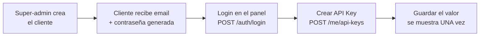

# Guía de integración con la API de FileStore

Documentación para quien consume FileStore desde otra aplicación: cómo obtener
credenciales, hacer la primera llamada y usar todos los endpoints de contenido.

Índice:

1. [Los dos canales de autenticación](#1-los-dos-canales-de-autenticación)
2. [Obtener una API Key](#2-obtener-una-api-key)
3. [Base URL y primera llamada](#3-base-url-y-primera-llamada)
4. [Flujo completo de ejemplo](#4-flujo-completo-de-ejemplo)
5. [Referencia de endpoints](#5-referencia-de-endpoints)
6. [Reglas y límites](#6-reglas-y-límites)
7. [Manejo de errores](#7-manejo-de-errores)
8. [Rate limiting](#8-rate-limiting)
9. [Buenas prácticas de seguridad](#9-buenas-prácticas-de-seguridad)
10. [Ejemplos por lenguaje](#10-ejemplos-por-lenguaje)
11. [El canal JWT](#11-el-canal-jwt-panel-y-frontends-propios)

---

## 1. Los dos canales de autenticación

FileStore expone dos formas de autenticarse, y **no son intercambiables**: cada
política de autorización declara explícitamente su esquema, así que un JWT
presentado a un endpoint de API Key no autentica, ni viceversa.

| Canal | Credencial | Para qué sirve |
|---|---|---|
| **API Key** | Header `X-Api-Key` | Integraciones servidor-a-servidor. Es el canal que te interesa si estás conectando tu app a FileStore. |
| **JWT** | Header `Authorization: Bearer …` | El panel web: autogestión del cliente (`/me`) y administración (`/admin`). |

Qué acepta cada grupo de endpoints:

| Endpoints | API Key | JWT (Client) | JWT (SuperAdmin) |
|---|:---:|:---:|:---:|
| `/files`, `/folders`, `/trash` | ✅ | ✅ | ❌ |
| `/whoami` | ✅ | ❌ | ❌ |
| `/me`, `/me/api-keys` | ❌ | ✅ | ❌ |
| `/admin`, `/admin/clients` | ❌ | ❌ | ✅ |
| `/auth/*`, `/health` | anónimo | | |

Los endpoints de contenido aceptan ambos canales porque el explorador del panel
consume exactamente los mismos endpoints que una integración externa. El
super-admin queda excluido a propósito: administra cuentas, pero no accede al
contenido de nadie.

---

## 2. Obtener una API Key

Las API Keys **no se crean por la API pública**: una key no puede crear otras
keys ni revocarse a sí misma. Se crean desde el panel, autenticado con JWT.

El camino completo desde cero:



1. **El super-admin da de alta tu cuenta de cliente** (`POST /admin/clients`).
   La respuesta incluye una contraseña generada que se muestra una única vez.

2. **Iniciás sesión** con ese email y contraseña:

   ```bash
   curl -X POST https://filestore.tudominio.com/auth/login \
     -H 'Content-Type: application/json' \
     -d '{"email":"tu@empresa.com","password":"la-generada"}'
   ```

   ```json
   {
     "accessToken": "eyJhbGciOiJIUzI1NiIsInR5cCI6IkpXVCJ9…",
     "expiresAt": "2026-07-25T21:15:00Z",
     "userId": "0198a1f2-…",
     "email": "tu@empresa.com",
     "role": "Client"
   }
   ```

3. **Creás la API Key** con ese access token:

   ```bash
   curl -X POST https://filestore.tudominio.com/me/api-keys \
     -H 'Authorization: Bearer <accessToken>' \
     -H 'Content-Type: application/json' \
     -d '{"name":"integracion-facturacion","rateLimitPerMinute":null}'
   ```

   ```json
   {
     "apiKey": {
       "id": "0198a1f3-…",
       "name": "integracion-facturacion",
       "prefix": "fs_live_A3xK9mQ2",
       "rateLimitPerMinute": null,
       "isActive": true,
       "lastUsedAt": null,
       "createdAt": "2026-07-25T20:40:00Z",
       "revokedAt": null
     },
     "value": "fs_live_A3xK9mQ2.hR7vN2pLxQ8mK4jT9wZ3cF6yB1nD5sG0aE8uI2oP7lM"
   }
   ```

> **`value` se devuelve una única vez.** Después de esta respuesta solo queda su
> hash en la base: no hay ningún endpoint que lo vuelva a mostrar. Si lo perdés,
> hay que rotar la key (`POST /me/api-keys/{id}/rotate`), lo que genera un valor
> nuevo e invalida el anterior.

### Formato de la key

```
fs_live_A3xK9mQ2.hR7vN2pLxQ8mK4jT9wZ3cF6yB1nD5sG0aE8uI2oP7lM
└──── prefijo ───┘ └──────────────── secreto ────────────────┘
     16 caracteres        32 bytes de entropía (base64url)
```

El **prefijo** es público: se guarda en claro, identifica la key en el panel y
es lo que permite buscarla por índice sin hashear toda la tabla. El **secreto**
solo existe en el momento de la creación. Al autenticar, se envía la cadena
completa (prefijo + `.` + secreto).

---

## 3. Base URL y primera llamada

| Entorno | Base URL |
|---|---|
| Desarrollo local | `https://localhost:7249` o `http://localhost:5263` |
| Producción | el dominio configurado en `PUBLIC_ORIGIN` |

En desarrollo también está **Swagger UI** en `/swagger`, con los dos candados
(JWT y API Key) ya configurados para probar desde el navegador. Fuera de
desarrollo Swagger no se monta.

El primer llamado recomendado es `GET /whoami`: existe precisamente para
verificar que tu key funciona y contra qué cliente resuelve, sin tener que
subir un archivo para probarlo.

```bash
curl https://filestore.tudominio.com/whoami \
  -H 'X-Api-Key: fs_live_A3xK9mQ2.hR7vN2pLxQ8…'
```

```json
{
  "clientId": "0198a1f2-…",
  "clientName": "Mi Empresa",
  "apiKeyId": "0198a1f3-…"
}
```

Si responde `401`, la key es inválida, está revocada, o la cuenta del cliente
está bloqueada o dada de baja.

> En desarrollo local sobre HTTPS el certificado es autofirmado: agregá `-k` a
> curl (o el equivalente en tu cliente HTTP) para las pruebas locales.

---

## 4. Flujo completo de ejemplo

Crear una carpeta, subir un archivo, listarlo y descargarlo.

```bash
BASE=https://filestore.tudominio.com
KEY='fs_live_A3xK9mQ2.hR7vN2pLxQ8…'

# 1. Crear una carpeta en la raíz
curl -X POST "$BASE/folders" \
  -H "X-Api-Key: $KEY" \
  -H 'Content-Type: application/json' \
  -d '{"name":"facturas","parentId":null}'
# → 201 {"id":"0198a2…","parentFolderId":null,"name":"facturas","path":"/facturas",…}

# 2. Subir un archivo a esa carpeta (multipart, campo "file")
curl -X POST "$BASE/files?folderId=0198a2…" \
  -H "X-Api-Key: $KEY" \
  -F 'file=@factura-001.pdf'
# → 201 {"id":"0198a3…","originalName":"factura-001.pdf","sizeBytes":48213,…}

# 3. Listar los archivos de la carpeta
curl "$BASE/files?folderId=0198a2…&page=1&pageSize=50" \
  -H "X-Api-Key: $KEY"
# → 200 {"items":[…],"page":1,"pageSize":50,"totalCount":1,"totalPages":1,"hasNextPage":false}

# 4. Descargar el binario
curl "$BASE/files/0198a3…" \
  -H "X-Api-Key: $KEY" \
  -o factura-001.pdf
```

---

## 5. Referencia de endpoints

Todos los endpoints de esta sección aceptan `X-Api-Key`. Los cuerpos JSON usan
`Content-Type: application/json`; la subida usa `multipart/form-data`.

### Archivos

#### `GET /files` — listar

| Query param | Tipo | Default | Notas |
|---|---|---|---|
| `folderId` | guid | *(null)* | Omitirlo lista la **raíz**. |
| `name` | string | — | Filtro por coincidencia parcial, case-insensitive. |
| `deleted` | bool | `false` | `true` lista los archivos en papelera (ignora `folderId`). |
| `page` | int | `1` | Debe ser > 0. |
| `pageSize` | int | `50` | Entre 1 y 200. |

Devuelve un `PagedResult<FileDto>`:

```json
{
  "items": [
    {
      "id": "0198a3…",
      "folderId": "0198a2…",
      "originalName": "factura-001.pdf",
      "sizeBytes": 48213,
      "mimeType": "application/pdf",
      "extension": "pdf",
      "versionCount": 2,
      "isDeleted": false,
      "deletedAt": null,
      "createdAt": "2026-07-25T20:41:00Z",
      "updatedAt": "2026-07-25T20:52:00Z"
    }
  ],
  "page": 1,
  "pageSize": 50,
  "totalCount": 1,
  "totalPages": 1,
  "hasNextPage": false
}
```

Los resultados vienen ordenados por `updatedAt` descendente.

#### `POST /files` — subir

`multipart/form-data` con el archivo en el campo **`file`**. Query param
opcional `folderId` (sin él, va a la raíz).

Respuestas: `201` con el `FileDto` y un header `Location` apuntando al
metadata. `400` si falta el archivo, viene vacío o el nombre/extensión no son
válidos. `413` si supera el tamaño máximo o no entra en la cuota. `404` si el
`folderId` no existe o no es tuyo.

> **Subir con el mismo nombre en la misma carpeta no crea un duplicado: crea
> una versión nueva** del archivo existente. Ver [versionado](#versionado).

#### `GET /files/{id}` — descargar

Devuelve el **binario**, no JSON. Query param opcional `version` (número de
versión) para bajar una versión histórica en vez de la vigente.

Soporta **range requests** (`Accept-Ranges`), así que se puede reanudar una
descarga o pedir un fragmento. El nombre original viaja en `Content-Disposition`
y el tipo en `Content-Type`.

#### `GET /files/{id}/metadata` — metadata sin descargar

Devuelve el `FileDto` del archivo. Útil para chequear tamaño o versión vigente
sin transferir el contenido.

#### `PATCH /files/{id}` — renombrar o mover

```json
{ "name": "factura-001-corregida.pdf", "folderId": "0198a4…", "moveToRoot": false }
```

Los tres campos son opcionales. Para **mover a la raíz** hay que enviar
`"moveToRoot": true` — mandar `folderId: null` no alcanza, porque no se puede
distinguir de "no querés cambiar la carpeta".

#### `DELETE /files/{id}` — enviar a la papelera

Borrado **suave**: `204`, el archivo va a la papelera y **sigue ocupando
cuota**. Es deliberado: obliga a vaciar la papelera o esperar la purga, y evita
que se acumulen datos invisibles que igual consumen espacio.

#### `GET /files/{id}/versions` — historial

```json
[
  {
    "id": "0198a5…",
    "versionNumber": 2,
    "sizeBytes": 48213,
    "mimeType": "application/pdf",
    "checksumSha256": "9f86d081884c7d65…",
    "isCurrent": true,
    "createdAt": "2026-07-25T20:52:00Z"
  }
]
```

El `checksumSha256` se calcula releyendo el binario ya escrito en disco, así
que sirve para verificar integridad end-to-end contra lo que subiste.

#### `POST /files/{id}/versions/{versionNumber}/restore` — restaurar versión

`204`. **Reapunta** la versión vigente a la indicada; no crea una versión nueva
ni consume cuota adicional.

### Carpetas

| Método | Ruta | Descripción |
|---|---|---|
| `GET` | `/folders?parentId=&all=false` | Lista las carpetas hijas de `parentId` (sin él, las de la raíz). `all=true` devuelve el árbol completo del cliente. |
| `POST` | `/folders` | Crea una carpeta: `{"name":"…","parentId":null}`. `409` si ya existe una con ese nombre en el mismo nivel. |
| `PATCH` | `/folders/{id}` | Renombra o mueve: `{"name":…,"parentId":…,"moveToRoot":false}`. Misma semántica de `moveToRoot` que en archivos. |
| `DELETE` | `/folders/{id}?recursive=false` | `409` si la carpeta no está vacía y no pasás `recursive=true`. |

`FolderDto` incluye un `path` cacheado (`/facturas/2026`), así que no hace falta
reconstruir la jerarquía a mano para mostrar una ruta.

### Papelera

| Método | Ruta | Descripción |
|---|---|---|
| `GET` | `/trash` | Lista los archivos borrados, con `deletedAt`, `purgeAt` y `daysUntilPurge`. |
| `POST` | `/trash/{id}/restore` | Saca el archivo de la papelera. `409` si en el destino ya existe otro archivo activo con el mismo nombre. |
| `DELETE` | `/trash/{id}` | Borrado **irreversible**: elimina el binario de todas las versiones y **libera la cuota**. |

Si la carpeta original fue eliminada mientras el archivo estaba en la papelera,
el archivo se restaura en la **raíz** en lugar de fallar.

Un job en background purga automáticamente lo que pase la retención
configurada; `purgeAt` te dice cuándo.

---

## 6. Reglas y límites

### Extensiones permitidas

El tipo MIME se deriva de la **extensión**, contra una tabla de tipos
permitidos administrada por el super-admin. No se inspecciona el contenido del
archivo. Si la extensión no está en la lista (o está deshabilitada), la subida
falla con `400`.

Tipos habilitados de fábrica:

| Extensión | MIME |
|---|---|
| `jpg` | `image/jpeg` |
| `png` | `image/png` |
| `gif` | `image/gif` |
| `webp` | `image/webp` |
| `pdf` | `application/pdf` |
| `docx` | `application/vnd.openxmlformats-officedocument.wordprocessingml.document` |
| `xlsx` | `application/vnd.openxmlformats-officedocument.spreadsheetml.sheet` |
| `txt` | `text/plain` |
| `csv` | `text/csv` |

Si necesitás otra extensión, tiene que habilitarla el super-admin: no es algo
que se pueda cambiar desde la API pública.

### Nombres de archivo

Máximo 255 caracteres. Se rechazan: nombres vacíos, `.` y `..`, los caracteres
`/ \ : * ? " < > |`, caracteres de control, los nombres reservados de Windows
(`CON`, `PRN`, `NUL`, `COM1`…`LPT9`), y terminar en punto o espacio.

La validación existe aunque el nombre original **nunca toque el disco** (la ruta
física se arma con GUIDs): el nombre se devuelve en `Content-Disposition` y
puede terminar escrito en el sistema de archivos de quien integra.

### Tamaño y cuota

| Límite | Default | Override |
|---|---|---|
| Tamaño máximo por archivo | 10 MiB (`10485760` bytes) | por cliente |
| Retención en papelera | 30 días | por cliente |
| Rate limit | 100 req/min | por API Key |

Dos cosas importantes sobre la cuota:

- **La papelera y las versiones cuentan.** Borrar un archivo no libera espacio
  hasta la purga o el borrado definitivo; cada versión nueva suma su propio
  tamaño.
- **La reserva es atómica.** Dos subidas concurrentes que juntas excederían la
  cuota no pueden pasar ambas: la validación ocurre dentro de la misma sentencia
  que incrementa el consumo. Si no entra, recibís `413`.

Podés consultar tu consumo con `GET /me/usage` (canal JWT).

### Versionado

Subir un archivo cuyo nombre **y** carpeta coinciden con uno existente no
duplica: agrega una versión al archivo existente, incrementando
`versionNumber`. Consecuencias prácticas:

- El `id` del archivo **no cambia** entre versiones; los enlaces siguen sirviendo.
- Cada versión ocupa cuota por separado.
- La comparación de nombre es exacta: `factura.pdf` y `Factura.pdf` son dos
  archivos distintos.

---

## 7. Manejo de errores

Todos los errores usan **Problem Details (RFC 7807)**, con
`Content-Type: application/problem+json`:

```json
{
  "status": 404,
  "title": "StoredFile with key 0198a3… was not found.",
  "instance": "/files/0198a3…"
}
```

Los errores de validación agregan un diccionario `errors`:

```json
{
  "status": 400,
  "title": "One or more validation errors occurred.",
  "instance": "/files",
  "errors": {
    "FileName": ["La extension '.exe' no esta permitida."]
  }
}
```

| Código | Cuándo | Qué hacer |
|---|---|---|
| `400` | Validación: extensión no permitida, nombre inválido, archivo vacío, paginación fuera de rango. | Corregir el request; reintentar no ayuda. |
| `401` | Falta la key, está mal formada, es inválida, fue revocada, o la cuenta está inactiva. | Revisar la credencial con `GET /whoami`. |
| `403` | Autenticado, pero sin permiso para ese endpoint (p. ej. un JWT de super-admin contra `/files`, o de cliente contra `/admin`). Presentar la credencial del canal equivocado da `401`, no `403`, porque el otro esquema no encuentra credencial alguna. | Usar el canal correcto. |
| `404` | El recurso no existe **o no es tuyo**. | No distinguir entre ambos casos es deliberado: no filtra la existencia de datos de otros clientes. |
| `409` | Conflicto de nombres: carpeta duplicada, carpeta no vacía sin `recursive`, restaurar sobre un nombre ya ocupado. | Resolver el conflicto (renombrar, `recursive=true`, etc.). |
| `413` | Supera el tamaño máximo o no entra en la cuota. | Liberar espacio (vaciar papelera) o pedir más cuota. |
| `429` | Se superó el rate limit. | Esperar lo que indique `Retry-After`. |
| `500` | Error inesperado. | Reintentar con backoff. El detalle queda en el log del servidor, nunca en la respuesta. |

Nunca vas a recibir stack traces ni mensajes internos: se registran del lado
del servidor pero no se envían, porque filtran estructura interna.

---

## 8. Rate limiting

- **Por API Key**, no por cliente ni por IP: agotar una key no afecta a las
  demás, ni siquiera a otras keys del mismo cliente.
- Ventana **fija de 1 minuto**, 100 peticiones por defecto (configurable por
  key con `rateLimitPerMinute`).
- **Sin cola**: al superar el límite se rechaza de inmediato en vez de dejarte
  esperando sin saber por qué.

La respuesta `429` incluye el header **`Retry-After`** con los segundos a
esperar:

```
HTTP/1.1 429 Too Many Requests
Retry-After: 37
Content-Type: application/problem+json

{"status":429,"title":"Se supero el limite de peticiones por minuto.","detail":"Reintenta en 37 segundos."}
```

Respetá `Retry-After` en vez de reintentar a ciegas. Para cargas masivas,
conviene pedir un `rateLimitPerMinute` mayor para esa key en lugar de
paralelizar contra el límite.

Aparte, `/auth/*` tiene un límite propio de **10 peticiones por minuto por IP**,
para frenar fuerza bruta contra el login.

---

## 9. Buenas prácticas de seguridad

- **La API Key es una credencial de servidor.** No la pongas en una app móvil,
  un frontend web ni un repositorio: cualquiera que la vea tiene acceso total
  al contenido de tu cuenta. Guardala en variables de entorno o un gestor de
  secretos.
- **Una key por integración.** Así podés revocar una sin cortar las demás, y el
  audit log te dice qué integración hizo cada cosa (`uploadedByApiKeyId` queda
  registrado en cada versión).
- **Rotá periódicamente** con `POST /me/api-keys/{id}/rotate`: devuelve un valor
  nuevo e invalida el anterior de inmediato. Desplegá el nuevo valor antes de
  rotar, o vas a tener una ventana de `401`.
- **Revocá lo que no uses** (`POST /me/api-keys/{id}/revoke`). `lastUsedAt` en
  `GET /me/api-keys` te ayuda a detectar keys olvidadas.
- **Siempre HTTPS.** La key viaja en un header; sobre HTTP plano queda expuesta.
- **Verificá el checksum** (`GET /files/{id}/versions`) si la integridad importa
  en tu caso de uso.

Toda acción mutante queda en el audit log con actor, recurso e IP; podés
consultarlo con `GET /me/audit-log` (canal JWT).

---

## 10. Ejemplos por lenguaje

### C# (`HttpClient`)

```csharp
var http = new HttpClient { BaseAddress = new Uri("https://filestore.tudominio.com") };
http.DefaultRequestHeaders.Add("X-Api-Key", Environment.GetEnvironmentVariable("FILESTORE_KEY"));

// Subir
using var content = new MultipartFormDataContent();
using var stream = File.OpenRead("factura-001.pdf");
content.Add(new StreamContent(stream), "file", "factura-001.pdf");

var response = await http.PostAsync("/files?folderId=0198a2…", content);
response.EnsureSuccessStatusCode();
var file = await response.Content.ReadFromJsonAsync<FileDto>();

// Descargar
await using var download = await http.GetStreamAsync($"/files/{file!.Id}");
await using var output = File.Create("descargado.pdf");
await download.CopyToAsync(output);
```

### Python (`requests`)

```python
import os, requests

BASE = "https://filestore.tudominio.com"
headers = {"X-Api-Key": os.environ["FILESTORE_KEY"]}

# Subir
with open("factura-001.pdf", "rb") as f:
    r = requests.post(
        f"{BASE}/files",
        headers=headers,
        params={"folderId": "0198a2…"},
        files={"file": ("factura-001.pdf", f, "application/pdf")},
    )
r.raise_for_status()
file_id = r.json()["id"]

# Descargar por streaming
with requests.get(f"{BASE}/files/{file_id}", headers=headers, stream=True) as r:
    r.raise_for_status()
    with open("descargado.pdf", "wb") as out:
        for chunk in r.iter_content(8192):
            out.write(chunk)
```

### Node.js (fetch nativo, 18+)

```javascript
const BASE = "https://filestore.tudominio.com";
const headers = { "X-Api-Key": process.env.FILESTORE_KEY };

// Subir
const form = new FormData();
form.append("file", new Blob([await fs.readFile("factura-001.pdf")]), "factura-001.pdf");

const res = await fetch(`${BASE}/files?folderId=0198a2…`, {
  method: "POST",
  headers,
  body: form,
});
if (!res.ok) throw new Error(`${res.status} ${JSON.stringify(await res.json())}`);
const { id } = await res.json();

// Descargar
const dl = await fetch(`${BASE}/files/${id}`, { headers });
await fs.writeFile("descargado.pdf", Buffer.from(await dl.arrayBuffer()));
```

### Reintentos con `Retry-After`

```python
import time, requests

def request_with_retry(method, url, *, headers, retries=3, **kwargs):
    for attempt in range(retries + 1):
        r = requests.request(method, url, headers=headers, **kwargs)

        # 429 y 5xx son transitorios; 4xx del resto no se arreglan reintentando.
        if r.status_code != 429 and r.status_code < 500:
            return r
        if attempt == retries:
            return r

        wait = int(r.headers.get("Retry-After", 2 ** attempt))
        time.sleep(wait)
```

---

## 11. El canal JWT (panel y frontends propios)

Solo relevante si estás construyendo una interfaz de usuario en vez de una
integración servidor-a-servidor.

| Método | Ruta | Notas |
|---|---|---|
| `POST` | `/auth/login` | `{"email":…,"password":…}` → access token + cookie de refresh. |
| `POST` | `/auth/refresh` | No lleva cuerpo: usa la cookie `fs_refresh`. |
| `POST` | `/auth/logout` | Revoca el refresh token y borra la cookie. |

Cómo está diseñada la sesión:

- El **access token** vive **15 minutos** y se devuelve en el cuerpo. Va en
  `Authorization: Bearer …` y debe quedar **solo en memoria**, nunca en
  `localStorage`.
- El **refresh token** vive **7 días** y viaja *únicamente* en una cookie
  `HttpOnly` + `Secure` + `SameSite=Strict`: JavaScript no puede leerlo, así
  que un XSS no roba la sesión, y un sitio externo no puede disparar el refresh.
- El refresh **rota** el token y **detecta reuso**: presentar uno ya usado
  invalida la cadena entera.
- No hay tolerancia de reloj: un token de 15 minutos vive exactamente 15
  minutos.

Como la cookie es `SameSite=Strict` y la política de CORS usa
`AllowCredentials`, el origen de tu frontend tiene que estar declarado
explícitamente en `Cors:AllowedOrigins` (`PUBLIC_ORIGIN` en producción).

Endpoints disponibles con JWT de rol `Client`, además de los de contenido:

| Ruta | Descripción |
|---|---|
| `GET /me` | Perfil, cuota y overrides. |
| `POST /me/change-password` | Revoca las demás sesiones y conserva la actual. |
| `GET /me/usage` | Consumo, conteo de archivos, tamaño de papelera. |
| `GET /me/stats?days=30` | Series para dashboards. |
| `GET /me/audit-log` | Auditoría paginada, filtrable por acción, recurso y fechas. |
| `GET/POST/PATCH /me/api-keys` | Gestión de API Keys (crear, rotar, revocar). |

---

## Ver también

- **Swagger UI** en `/swagger` (solo en desarrollo): el contrato ejecutable y
  siempre sincronizado con el código.
- [README.md](README.md) — arquitectura y cómo correr el proyecto.
- [SECRETS.md](SECRETS.md) — configuración de secretos en desarrollo.
- [DEPLOYMENT.md](DEPLOYMENT.md) — despliegue en VPS.
