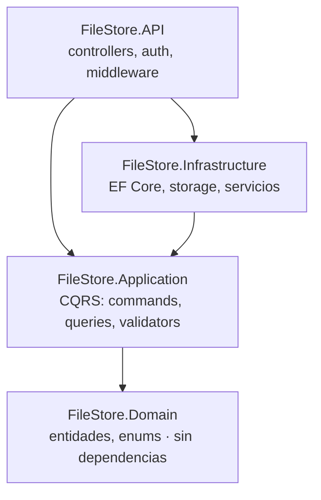

# FileStore

Servicio de gestión de archivos multi-cliente estilo SaaS, con aislamiento total
entre clientes. Cada cliente sube y organiza archivos vía API REST (autenticada
con API Keys) y se autogestiona desde un panel web (autenticado con JWT). Un
super-admin da de alta clientes y configura el sistema.

Proyecto construido como caso de estudio de **Clean Architecture** y **.NET
moderno**, con foco en seguridad y aislamiento de datos.

---

## Características

- **Multi-tenant con aislamiento total**: cada request valida propiedad por
  `ClientId`; un cliente nunca puede leer, listar ni descargar datos de otro.
- **Autenticación dual**:
  - **API Keys** (`fs_live_…`) para la API REST — se persiste solo el hash, el
    valor completo se muestra una única vez.
  - **JWT** para el panel, con refresh token en cookie `httpOnly` (rotación +
    detección de reuso); el access token vive solo en memoria del navegador.
- **Carpetas jerárquicas** con `path` cacheado.
- **Versionado de archivos**: re-subir el mismo nombre crea una versión nueva;
  se puede restaurar una versión antigua como vigente.
- **Papelera con soft-delete** y purga automática por retención configurable.
  La papelera y las versiones **cuentan para la cuota**.
- **Cuotas por cliente** con reserva atómica bajo concurrencia.
- **Rate limiting** por API Key y por IP en los endpoints de credenciales.
- **Auditoría**: cada acción mutante queda registrada con actor, recurso e IP.
- **Panel de super-admin**: alta de clientes, configuración global, dashboards.
- **i18n** desde la primera vista.

---

## Arquitectura

Clean Architecture en 4 capas, con la regla de dependencias apuntando siempre
hacia el dominio. `Domain` no referencia a nadie; la lógica de aplicación se
organiza en **CQRS** (comandos y queries) con MediatR.



Decisiones clave:

- **`IStorageService` opera sobre `Stream`**, no sobre rutas ni `byte[]`: permite
  envolverlo con un decorador de cifrado sin tocar ningún handler.
- **Ruta física por GUID** (`{clientId}/{yyyy}/{MM}/{fileVersionId}.bin`): el
  nombre original nunca entra en la ruta, lo que cierra el path traversal.
- **Cifrado en reposo a nivel de disco** (LUKS), no a nivel de aplicación en el
  MVP: `IStorageService` queda diseñado para admitirlo más adelante.

---

## Stack

**Backend** · .NET 10 · Clean Architecture + CQRS
- MediatR 12.5 · FluentValidation 12 · EF Core + Npgsql 10 (PostgreSQL 16)
- Serilog · Swashbuckle (OpenAPI) · autenticación JWT + API Key custom

**Frontend** · Angular 21 (standalone components, signals)
- Tailwind CSS 4 · ngx-translate · Chart.js 4

**Infraestructura** · Docker Compose · Nginx (reverse proxy + TLS) · LUKS

---

## Estructura del repositorio

```
backend/
  FileStore.Domain/          Entidades y enums (sin dependencias)
  FileStore.Application/     CQRS: features, validators, abstracciones
  FileStore.Infrastructure/  EF Core, storage, auth, jobs, seeders
  FileStore.API/             Controllers, middleware, composición
  tests/
    FileStore.UnitTests/         Reglas de negocio
    FileStore.IntegrationTests/  Flujo real contra Postgres de prueba
frontend/                    Panel Angular
API.md                       Guía de integración para consumidores de la API
SECRETS.md                   Configuración de secretos en desarrollo
DEPLOYMENT.md                Guía de despliegue en VPS
```

---

## Correr en local

**Requisitos**: .NET 10 SDK · Node 22+ · PostgreSQL 16.

### Backend

```bash
# 1. Configurar los secretos (fuera del repo). Va primero: las migraciones
#    necesitan la cadena de conexión. Ver SECRETS.md para el detalle.
./scripts/setup-dev-secrets.sh

# 2. Crear el esquema
dotnet ef database update --project backend/FileStore.Infrastructure --startup-project backend/FileStore.API

# 3. Ejecutar
dotnet run --project backend/FileStore.API
```

El script pide la conexión a Postgres y el super-admin, y genera el `Jwt:Secret`
automáticamente. Es idempotente: no sobreescribe lo que ya exista.

En desarrollo, con `Seed:Demo` activo y la base sin clientes, se siembran datos
de demostración (clientes, API Keys, archivos con versiones y papelera); las
credenciales y las API Keys aparecen en el log al arrancar.

### Frontend

```bash
cd frontend
npm install
npm start        # http://localhost:4200, con proxy a la API
```

---

## Tests

```bash
cd backend
dotnet test                    # unit + integración
```

Los tests de integración corren contra una base Postgres real (`filestore_test`)
mediante `WebApplicationFactory`, y verifican el flujo completo de subida y —lo
más importante— el **aislamiento entre clientes**.

```bash
cd frontend
npm test                       # componentes (vitest)
```

---

## Consumir la API

Guía de integración en [API.md](API.md): cómo obtener una API Key, referencia de
todos los endpoints de contenido, límites, manejo de errores y ejemplos en C#,
Python y Node.

En desarrollo, el contrato ejecutable está en `/swagger`.

---

## Despliegue

Guía completa en [DEPLOYMENT.md](DEPLOYMENT.md): Docker Compose, Nginx con TLS de
Let's Encrypt, cifrado de disco con LUKS, migraciones controladas y backups
consistentes y cifrados.

---

## Seguridad

- Aislamiento por `ClientId` validado en cada endpoint.
- API Keys y refresh tokens: se persiste solo el hash (SHA-256), nunca el valor.
- Contraseñas con `PasswordHasher` de ASP.NET Identity.
- Refresh token en cookie `httpOnly` + `Secure` + `SameSite`, con rotación y
  revocación de la cadena ante reuso.
- Rate limiting contra fuerza bruta en `/auth` y por API Key en la API.
- Errores uniformes con Problem Details (RFC 7807).
